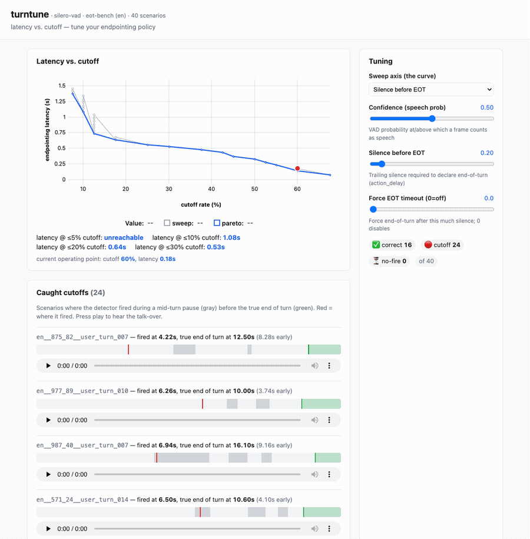

# turntune

**See your voice agent's latency-vs-cutoff tradeoff, find the conversations where it talks over people, and dial in the endpointing policy.**

[](./LICENSE)

[](https://github.com/Kayvan-Zahiri/turntune/actions/workflows/ci.yml)



> Silero VAD over 40 eot-bench conversations. Drag **Silence before EOT** and the whole
> curve, the red operating-point marker (here sliding from 60% cutoff toward 30%), the
> live counts, and the caught-cutoff list all recompute in milliseconds. Each cutoff has
> a timeline — gray = mid-turn pause, green = true end of turn, red = where it fired —
> and audio you can play to hear the talk-over.

---

## Why turn-taking matters

Turn-taking — deciding the moment the user is *done* speaking — is one of the
highest-leverage quality problems in a voice agent. Endpoint **too early** and the
agent talks over people mid-sentence. Endpoint **too late** and every exchange
fills with awkward dead air. The two failure modes pull in opposite directions, so
there's a real tradeoff to navigate.

`turntune` makes that tradeoff **measurable and tunable**. Point it at a turn
detector and it shows you, over a set of real conversations: how often the detector
cuts users off, how much latency it adds, and exactly how that curve shifts when
you change the endpointing policy.

## What you get

- 📈 **The latency-vs-cutoff Pareto curve** for your detector — and the headline
  number, _"latency at ≤X% cutoff."_
- 🔊 **A playable list of the conversations it cut off** — hear the talk-over for
  yourself instead of guessing.
- 🎚️ **Live tuning knobs** — drag the silence / confidence / timeout sliders and
  watch the curve and the failure list update instantly.

## 30-second quickstart

```bash
git clone https://github.com/Kayvan-Zahiri/turntune
cd turntune
make run
```

`make run` creates a virtualenv, installs `turntune`, and launches the local web UI.
On first run it downloads the Silero VAD model (~2 MB) and a small subset of
LiveKit's [eot-bench](https://huggingface.co/datasets/livekit/eot-bench-data)
scenarios, then opens **http://localhost:8000**.

No GPU, no API keys, no account. Everything runs locally.

> No Hugging Face access or want to try it instantly offline? `turntune serve --dataset fixtures`
> runs against a tiny bundled scenario set (a structural smoke test — synthetic audio,
> so no real cutoffs; the real evaluation uses eot-bench).

## Reading the results


Three things are on screen:

- **The curve (top-left).** Every point is one policy setting: x = how often the
  detector cut someone off, y = how much latency it added. **Lower-left is better** —
  few cutoffs *and* low latency. The blue line is the Pareto frontier (the best you can
  do); the red dot is your **current operating point**. The headline beneath it —
  _"latency @ ≤10% cutoff: 1.04s"_ — is the lowest latency you can buy while staying
  under that cutoff budget.
- **The knobs (top-right).** Drag a slider and the curve, the operating point, the
  counts, and the failure list all recompute live. Find the operating point you can
  live with, then read off the threshold.
- **The caught cutoffs (below).** Every conversation the detector talked over, under the
  current policy. Each timeline shows the mid-turn pauses (gray), the true end of turn
  (green), and where the detector fired (red) — with an audio player so you can *hear*
  the talk-over.

## How it works

```
eot-bench loader ─▶ 20ms / 16kHz audio harness ─▶ Silero VAD (run ONCE, signal cached)
                                                          │
                                  cheap endpointing policy replayed across the sweep
                                                          │
                                   metrics ─▶ latency-vs-cutoff curve + failure playback
```

Each detector is split into two halves: an **expensive `extract()`** that runs the
neural model over the audio exactly once and caches a per-frame signal, and a
**cheap, pure `decide()`** that turns that signal + your tuning knobs into an
end-of-turn decision. Because tuning only re-runs the cheap half over cached
signals, the whole sweep recomputes in milliseconds — so the curve feels live as
you drag a slider. (Audio is streamed in 20 ms frames; decision times come from the
frame index, not the wall clock, so the fast sweep gives the same answer as real-time
streaming.)

## The tuning knobs

These are the same knobs LiveKit's eot-bench exposes, so a policy setting maps between
the two (the eot-bench name is in parentheses). The arrows show what happens as you
**increase** each knob.

| Knob (eot-bench name) | What it does | Cutoffs | Latency |
|---|---|---|---|
| `speech_threshold` (`threshold`), 0.1–0.9 | VAD probability above which a frame counts as speech | ↑ (more audio read as silence → endpoints sooner) | ↓ |
| `min_silence_s` (`action_delay`), 0.1–1.5 — **primary sweep axis** | trailing silence required before declaring end-of-turn | ↓ (waits out mid-turn pauses) | ↑ |
| `timeout_s` (`timeout`), optional | force end-of-turn after this much silence (bounds dead air; mainly a backstop) | – | caps worst case |

## How the metrics are defined

- **Cutoff (false endpoint):** the detector declared end-of-turn during a *mid-turn
  pause*, before the user was actually done. The **cutoff rate** is the fraction of
  conversations where that happens.
- **Latency:** how long *after* the true end of turn the detector took to fire,
  measured on the audio timeline (conversational dead air) — not compute time. A model
  that waits 600 ms to be sure still shows 600 ms of latency.
- **Pareto frontier:** the settings where you can't lower one without raising the
  other. The summary reports the best latency at each cutoff budget (e.g. ≤10%).

Ground truth comes straight from eot-bench: the **final** silence in each clip is the
true end of turn; every **earlier** silence is a mid-turn hold. Full definitions in
[`docs/metrics.md`](./docs/metrics.md).

## Adding your own detector

`turntune` has two pluggable seams. To add a detector, implement the `Detector`
protocol (`extract` + `decide`) and register it. See
[`examples/custom_detector.py`](./examples/custom_detector.py) and
[`CONTRIBUTING.md`](./CONTRIBUTING.md).

## Adding your own scenarios

Implement a `ScenarioLoader` that yields `Scenario` objects with `hold`/`eot`
spans. The bundled fixtures loader is the worked example. (eot-bench is the v0
default; custom and synthetic scenario sets are a clean drop-in later.)

## Configuration

```
turntune serve    # default: launch the local web UI
turntune run      # headless: print the curve + operating points
turntune sweep    # headless: write the full sweep to JSON (--out sweep.json)
```

Common flags (any subcommand): `--detector silero-vad`, `--dataset eot-bench|fixtures`,
`--language en`, `--limit 100`, `--sweep-axis min_silence_s`. `serve` also takes
`--port 8000`, `--open` (open a browser), and `--realtime` (stream at mic pace — demo
fidelity; off for sweeps).

The runtime cache (downloaded model, eot-bench subset, per-frame signals) lives in
`.turntune_cache/`. Wipe it with `rm -rf .turntune_cache`.

## Roadmap / out of scope for v0

v0 is **component-level** evaluation of a single detector. Explicitly **not** in v0:

- End-to-end testing of a live deployed agent (driving audio over WebRTC/telephony
  and timestamping its spoken response).
- Synthetic scenario generation (TTS + programmatic pause/disfluency insertion).
- Hosting, multi-tenancy, auth, billing.

## Data & licensing

This project's **code is Apache-2.0** (see [`LICENSE`](./LICENSE)). The eot-bench
scenarios are **downloaded at runtime from Hugging Face and are not vendored** here;
they belong to LiveKit and are licensed **CC-BY-4.0** — attribution required; see the
[dataset card](https://huggingface.co/datasets/livekit/eot-bench-data). Built on
[Silero VAD](https://github.com/snakers4/silero-vad) (MIT) and
[LiveKit eot-bench](https://github.com/livekit/eot-bench) (Apache-2.0).

## Contributing & troubleshooting

See [`CONTRIBUTING.md`](./CONTRIBUTING.md). Common first-run issues (onnxruntime
wheels, Hugging Face download/rate limits, port already in use) are documented
there. Tests run fully offline against bundled fixtures: `make test`.
