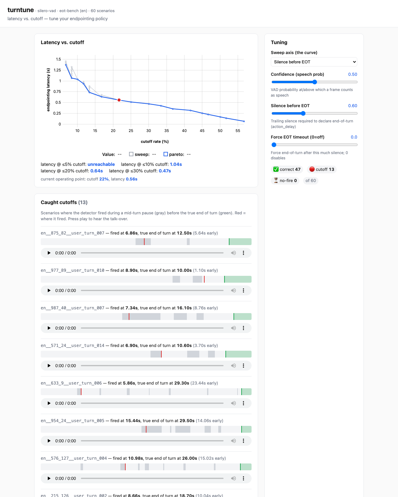

# turntune

**See your voice agent's latency-vs-cutoff tradeoff, find the conversations where it talks over people, and dial in the endpointing policy.**

[](./LICENSE)

<!-- TODO(step 5): add CI badge once the repo is public -->



> Silero VAD over 60 eot-bench scenarios: the tradeoff curve with the live operating
> point, the tuning knobs, and every conversation it cut off — each with a timeline
> (gray = mid-turn pause, green = true end of turn, red = where it fired) and audio you
> can play.

---

## Why turn-taking matters

Turn-taking — deciding the moment the user is *done* speaking — is one of the
highest-leverage quality problems in a voice agent. Endpoint **too early** and the
agent talks over people mid-sentence. Endpoint **too late** and every exchange
fills with awkward dead air. The two failure modes pull in opposite directions, so
there's a real tradeoff to navigate — and today most teams navigate it *by ear*,
nudging a silence timeout until the demo feels okay and then waiting for bug
reports.

`turntune` makes that tradeoff **measurable and tunable**. Point it at a turn
detector and it shows you, over a set of real conversations: how often the detector
cuts users off, how much latency it adds, and exactly how that curve shifts when
you change the endpointing policy.

## What you get

- 📈 **The latency-vs-cutoff Pareto curve** for your detector — and the headline
  number, _"latency at ≤X% cutoff."_
- 🔊 **A playable list of the conversations it cut off** — hear the talk-over for
  yourself instead of guessing.
- 🎚️ **Live tuning knobs** — drag the silence / confidence / min-delay sliders and
  watch the curve and the failure list update instantly.

<!-- TODO(step 5): three thumbnails, one per bullet above. -->

## 30-second quickstart

```bash
git clone https://github.com/OWNER/turn-detection
cd turn-detection
make run
```

`make run` creates a virtualenv, installs `turntune`, and launches the local web UI.
On first run it downloads the Silero VAD model (~2 MB) and a small subset of
LiveKit's [eot-bench](https://huggingface.co/datasets/livekit/eot-bench-data)
scenarios, then opens **http://localhost:8000**.

No GPU, no API keys, no account. Everything runs locally.

> No Hugging Face access or want to try it instantly offline? `turntune serve --dataset fixtures`
> runs against a tiny bundled scenario set.

<!-- TODO(step 5): screenshot walkthrough — reading the curve, picking an operating
     point, the "latency at ≤X% cutoff" summary, hearing a caught cutoff. -->

## How it works

```
eot-bench loader ─▶ 20ms / 16kHz audio harness ─▶ Silero VAD (run ONCE, signal cached)
                                                          │
                                  cheap endpointing policy replayed across the sweep
                                                          │
                                   metrics ─▶ latency-vs-cutoff curve + failure playback
```

Each detector is split into two halves: an **expensive `extract()`** that runs the
neural model over the audio exactly once and caches a per-frame signal, and a
**cheap, pure `decide()`** that turns that signal + your tuning knobs into an
end-of-turn decision. Because tuning only re-runs the cheap half over cached
signals, the whole sweep recomputes in milliseconds — so the curve feels live as
you drag a slider.

<!-- TODO(step 3+): expand once the harness + metrics land. -->

## The tuning knobs

These map directly to the three knobs LiveKit's eot-bench sweeps, so the numbers are
comparable. The arrows show what happens as you **increase** each knob.

| Knob (eot-bench name) | What it does | Cutoffs | Latency |
|---|---|---|---|
| `speech_threshold` (`threshold`), 0.1–0.9 | VAD probability above which a frame counts as speech | ↑ (more audio read as silence → endpoints sooner) | ↓ |
| `min_silence_s` (`action_delay`), 0.1–1.5 — **primary sweep axis** | trailing silence required before declaring end-of-turn | ↓ (waits out mid-turn pauses) | ↑ |
| `timeout_s` (`timeout`), optional | force end-of-turn after this much silence (bounds dead air; mainly a backstop) | – | caps worst case |

## How the metrics are defined

A **cutoff** is the detector firing during a *mid-turn pause* (a `hold` span)
before the true end of turn. **Latency** is how long after the true end of turn the
detector takes to fire. The **Pareto frontier** is the set of policy settings where
you can't reduce one without increasing the other. See
[`docs/metrics.md`](./docs/metrics.md) for precise definitions.

## Adding your own detector

`turntune` has two pluggable seams. To add a detector, implement the `Detector`
protocol (`extract` + `decide`) and register it. See
[`examples/custom_detector.py`](./examples/custom_detector.py) and
[`CONTRIBUTING.md`](./CONTRIBUTING.md).

## Adding your own scenarios

Implement a `ScenarioLoader` that yields `Scenario` objects with `hold`/`eot`
spans. The bundled fixtures loader is the worked example. (eot-bench is the v0
default; custom and synthetic scenario sets are a clean drop-in later.)

## Configuration

<!-- TODO(step 4): finalize flags once the CLI lands. -->

```
turntune serve [--detector silero-vad] [--dataset eot-bench|fixtures]
               [--language en] [--limit 100] [--realtime]
               [--port 8000] [--no-browser]
```

The runtime cache lives in `.turntune_cache/`. Wipe it with `rm -rf .turntune_cache`.

## Roadmap / out of scope for v0

v0 is **component-level** evaluation of a single detector. Explicitly **not** in v0:

- End-to-end testing of a live deployed agent (driving audio over WebRTC/telephony
  and timestamping its spoken response).
- Synthetic scenario generation (TTS + programmatic pause/disfluency insertion).
- Hosting, multi-tenancy, auth, billing.

## Data & licensing

This project's **code is Apache-2.0** (see [`LICENSE`](./LICENSE)). The eot-bench
scenarios are **downloaded at runtime from Hugging Face and are not vendored** here;
they belong to LiveKit and are licensed **CC-BY-4.0** — attribution required; see the
[dataset card](https://huggingface.co/datasets/livekit/eot-bench-data). Built on
[Silero VAD](https://github.com/snakers4/silero-vad) (MIT) and
[LiveKit eot-bench](https://github.com/livekit/eot-bench) (Apache-2.0).

## Contributing & troubleshooting

See [`CONTRIBUTING.md`](./CONTRIBUTING.md). Common first-run issues (onnxruntime
wheels, Hugging Face download/rate limits, port already in use) are documented
there. Tests run fully offline against bundled fixtures: `make test`.
